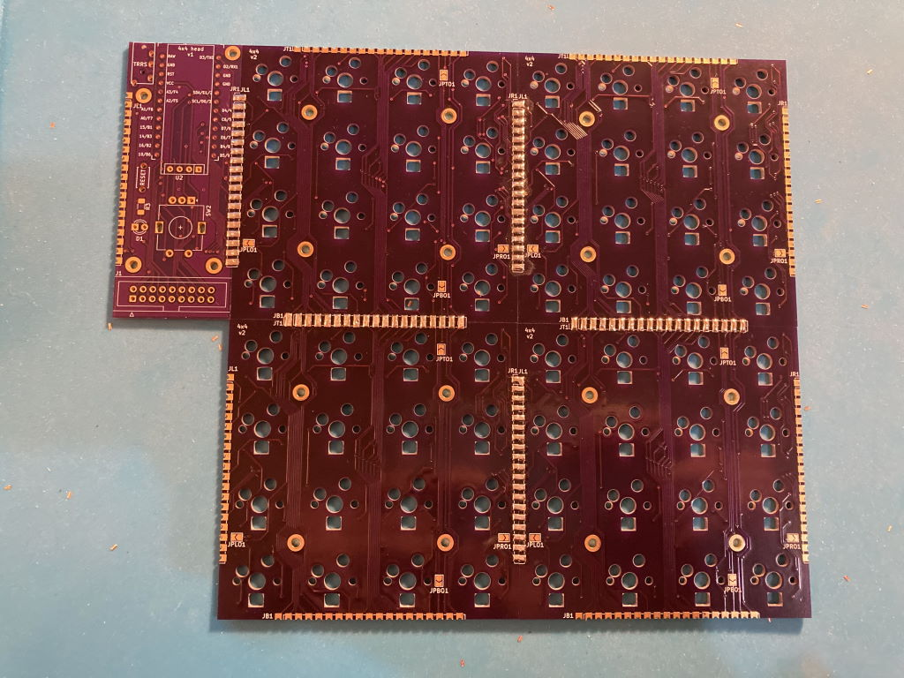

# 4x4 keyboard
 
The 4x4 keyboard is a modular keyboard with per-key RGB lighting intended to be used as a base for prototyping MIDI controller with QMK firmware.

It consists of the following parts:
* Head PCB with MCU and other connectors
* 1 to 4 key PCB, each having 16 hotswap Cherry MX switches in 4x4 layout

These parts can be soldered together in different configurations, resulting in different layouts, such as 4x12 Planck layout or 8x8 layout similar to MIDI drumpads controllers.

The modular design allows to iterate on parts of it without remaking a large PCB. It also makes it cost-effective to order from PCB prototyping service - ordering the typical minimum of 3 to 5 pieces of key PCB makes a single full-sized keyboard with no excessive number of spares.

PCB pieces use castellated pads to route all the signals. These pads are soldered together placing the PCBs side by side, connecting them electrically and also holding them together physically.

## Switch matrix

To allow for modularity and avoid using lots of wires to connect parts together, electrical layout of the key PCBs doesn't match their physical layout. Even though physically they are 4x4, electrically switches are laid out in 2 columns and 8 rows:
 Each key module uses the same row wires but separate columns so the full electrical layout is 8x8 if there are 4 key modules.

The column lines are routed through the key PCBs such that columns are shifted in the next connected module: if a key module is directly connected to the head, it will connect to columns 1 and 2. Module attached to the right of it will use columns 3 and 4, and so on. Attaching a module to the bottom of another shifts columns by 4 instead. The end result is that in all supported configurations, simply soldering the key modules together in the desired layout gives each of them a unique pair of column wires connected to the MCU.

Row lines are not shifted, they are passed through across the key modules as is and connect to the same MCU pin in every module.

## LED connections

WS6812 mini-e LEDs are used to provide per-key RGB. These LEDs require that they are connected in a chain to let the signal propagate from one LED to another. Within each key module, they are connected like this: 

To connect them across key modules, jumpers need to be soldered on each module to specify the side that takes LED input from previous module in the chain, and the side connecting to the next module:
* JP(L/R/T/B)I jumpers specify the left/right/top/bottom side as input
* JP(L/R/T/B)O jumpers specify the output side

This builds a chain of key modules, connecting the last LED in the preceding module to the first LED in the next:

* Input jumpers:

* Output jumpers:

## Bill of material

| Item | Quantity | Comment | Source |
| --- | --- | --- | --- |
| Head PCB | 1 |
| Key PCBs | 1-4 |
| ProMicro MCU | 1 |
| MCU socket | 1 | 2 strips of 12 pins each | https://www.digikey.com/en/products/detail/mill-max-manufacturing-corp/310-43-112-41-001000/1212186 |
| Reset tactile button | 1 | |
| TRRS jack | 1 | To support split keyboard, optional | https://boardsource.xyz/store/5eca3b7d64caf04f83aa6488 |
| Kailh MX hotswap sockets | 16-64 | | https://boardsource.xyz/store/5eca066464caf04f83aa647f |
| N4148 SOD-123 diodes | 16-64 | | https://www.digikey.com/en/products/detail/panjit-international-inc/1N4148W-R1-00001/14660400 |
| SK6812 mini-e RGB LEDs | 16-64 | Optional | https://boardsource.xyz/store/5f6316e0a2c1b43e37ca04c3 |
| Cherry MX compatible switches, keycaps | 16-64 |
| Switch plate, case | | Optional | See some example designs [here](case/)
| M2 bolts and standoffs | 8-20 |

## Build

1. Decide on the layout
    * Options: horizontal strip of 1-4, vertical strip of 2, 2x2 square  
    * Head position: any side of the key block, facing up or left    
2. Prep the PCBs
	1. Clean up the castellated edges if needed. Make sure key PCBs sit flush to each other
	2. Make sure LEDs fit in the holes, file to enlarge them if necessary
3. Solder together the PCBs pieces
	1. Use something to help hold PCBs together, like [the 3d printed holder](misc/4x4holder.stl)
        * Make sure both PCBs face the same way before soldering
        * Make sure PCBs sit flat and even as you solder, using a ruler to check they don't bend at the seam once every few soldered pads:
        
        * Tip: if using a 3D printed frame to hold PCBs, add washers before screwing the PCBs to it so plastic doesn't touch the hot contacts as you solder them
        	
	2. Turn over and clean up on the other side
    
	
4. Solder the jumpers for LED signal chaining
5. Solder the MCU socket so that you can test the rest as you go
6. Solder the per-key elements
    1. LEDs
	2. Diodes
	3. Switch hotswap sockets
7. Solder the remaining head elements
	1. TRRS jack
	2. Reset tactile button

End result:
* Top 
* Bottom 

## Firmware

This keyboard is using [QMK](https://qmk.fm/). Example layout making the keyboard work as a combination of planck keyboard and a MIDI controller is available [here](https://github.com/nezumee/qmk_firmware/tree/4x4/keyboards/4x4/keymaps/midi-controller). Note that you need [the MIDI input fix](https://github.com/qmk/qmk_firmware/pull/18654) for the MIDI feedback to work.

## Using 4x4 as a MIDI controller

QMK has MIDI support that allows using the keyboard as a MIDI controller. Per-key RGB also makes it possible to have MIDI feedback, such that each key lights up depending on the status in the DAW. For example, you can set it up that keyboard keys trigger clips or scenes, and have those keys light up in the right color when there's an active clip or when a track is armed for recording.

This support requires some integration in the DAW. Remote MIDI script for Ableton Live working with the Planck-like layout is [here](ableton_live/FourByFour).

## Known problems

* Head v1
	* There are OLED and encoder footprints, but they cannot be used since the same pins are reused for switch rows
* Brightness must be restricted when using many LEDs (48+), voltage regulator in ProMicro cannot handle them otherwise
* Split keyboard is not tested, is challenging due to LED power consumption

## License

This project is using the [MIT license](LICENSE).